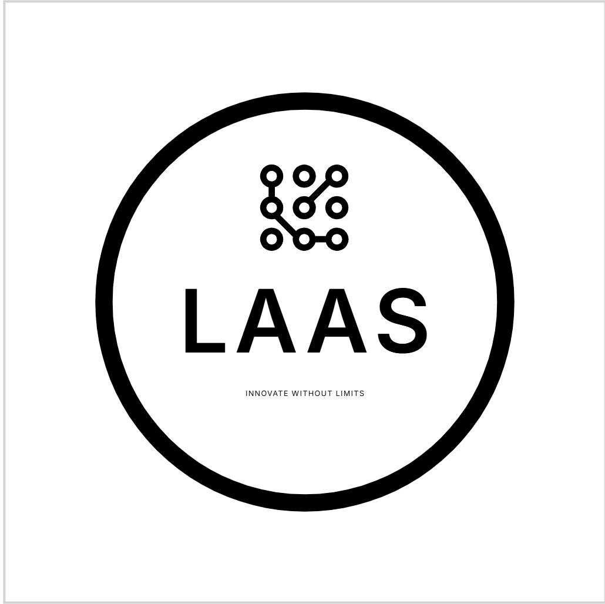

# 🚀 LAAS Summarizer & Explainer (Chrome Extension)

> A smart Chrome extension to **summarize long text, visualize insights, create fun meme-style summaries, and even generate explainer videos** – all in one place.  
> Built with ❤️ by **Tejas (LAAS)**.

---

## ✨ Features

✅ **Normal Summary** – Clean text summarization  
😂 **Fun Meme Summary** – Converts boring text into funny meme-style lines  
🎮 **Gamification** – Badges & motivational popups while using  
🥚 **Easter Egg** – Hidden chai-break reminder after 10 summaries  
📝 **History** – Stores last 5 summaries for quick access  
🚀 **Quick Share** – Copy to clipboard & send directly via WhatsApp  
⚙️ **Settings Page** – Choose default summary length, dark mode etc.  
ℹ️ **About Page** – Branded info with Tejas’s name & logo  

---

## 🖼️ Screenshots

> Add your screenshots inside the `screenshots/` folder.

| Popup | Settings | About |
|-------|----------|-------|
|  |  |  |

---

## 🔧 Installation (Developer Mode)

1. Download this repository as ZIP or clone it.
2. Open Chrome and go to: `chrome://extensions/`
3. Enable **Developer Mode** (top-right corner).
4. Click **Load unpacked** and select the `laas-extension` folder.
5. The LAAS icon will appear in your toolbar 🎉
